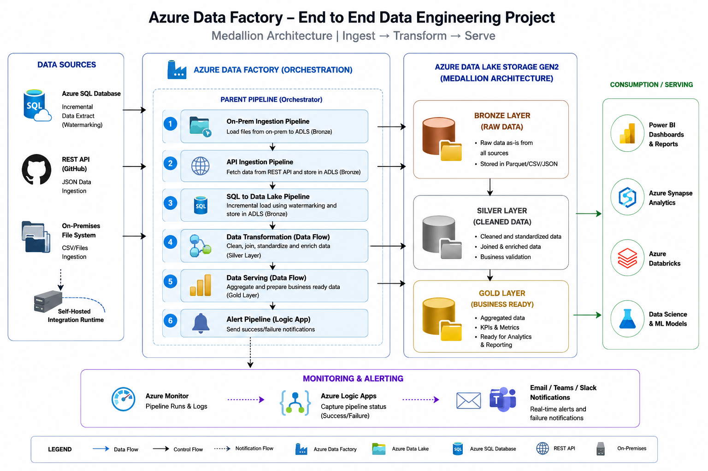

# 🚀 Azure Data Factory End-to-End Data Engineering Project

## 📌 Project Overview
This project demonstrates a complete end-to-end data engineering pipeline built using Azure Data Factory (ADF). It implements a Medallion Architecture (Bronze → Silver → Gold) to ingest, transform, and serve data from multiple sources including SQL Database, APIs, and On-Prem file systems.
The solution is designed to simulate a real-world enterprise data platform with modular pipelines, reusable components, and scalable architecture.

---

## 🔥 Project Highlights
- Built fully modular ADF pipelines with reusable components
- Implemented incremental loading using watermarking strategy
- Integrated on-prem, API, and cloud sources in one unified pipeline
- Designed Medallion architecture using ADLS Gen2
- Enabled real-time failure alerts using Logic Apps

---

## 🏗️ Architecture

The project follows a Medallion Architecture pattern:
Bronze Layer → Raw data ingestion from multiple sources
Silver Layer → Data cleaning, transformation, and standardization
Gold Layer → Business-ready aggregated and analytical data
📌 Sources used:
Azure SQL Database
REST API (GitHub hosted JSON)
On-Prem File System (via Self-hosted Integration Runtime)

---

## 🧭 Architecture Diagram

---

## 🔄 Pipeline Flow
### 1️⃣ Parent Orchestration Pipeline
- Controls execution of all child pipelines
- Ensures sequential workflow:
    - On-Prem Ingestion
    - API Ingestion
    - SQL Ingestion
    - Alert Notification

---

### 2️⃣ On-Prem Ingestion Pipeline
- Reads CSV files using File Server connector
- Uses ForEach activity for dynamic file processing
- Loads data into Azure Data Lake Storage (ADLS)

---

### 3️⃣ API Ingestion Pipeline
- Fetches JSON data from REST API (GitHub)
- Uses Web Activity + Copy Activity
- Stores raw data in ADLS

---

### 4️⃣ SQL to Data Lake Pipeline
- Implements incremental loading using watermarking
- Extracts data from Azure SQL Database
- Stores optimized data in Parquet format

---

### 5️⃣ Silver Layer (Data Transformation)
- Data cleaning and standardization
- Schema alignment
- Data enrichment using Mapping Data Flows

---

### 6️⃣ Gold Layer (Data Serving)
- Business-ready aggregated datasets
- KPI and reporting layer
- Optimized for Power BI / analytics tools

---

## 🔔 Monitoring & Alerts
- Integrated with Azure Logic Apps
- Sends real-time pipeline status notifications:
    - Success
    - Failure
    - Execution logs

---

## 📂 Project Structure

ADF_Project/
│
├── adf_json/
│   ├── pipelines/
│   ├── datasets/
│   ├── linked_services/
│   └── dataflows/
│
├── source_data/
│   ├── csv/
│   ├── json/
│   └── sql/
│
├── screenshots/
│   ├── ingestion/
│   ├── transformation/
│   ├── gold_layer/
│   └── architecture/
│
└── README.md

---

## ⚙️ Technologies Used
- Azure Data Factory (ADF)
- Azure Data Lake Storage Gen2
- Azure SQL Database
- REST APIs
- Azure Logic Apps
- Mapping Data Flows
- Self-hosted Integration Runtime

---

## 📌 Key Features
- 🔄 End-to-end ETL/ELT pipeline orchestration
- 🧱 Medallion Architecture implementation
- ⚡ Incremental data loading (Watermarking)
- 🌐 Multi-source ingestion (SQL, API, On-Prem)
- 🔔 Real-time alerting system
- 📊 Analytics-ready Gold layer

---

## 📈 Learning Outcomes
- Designing scalable data pipelines in Azure
- Implementing Medallion Architecture
- Building incremental ingestion systems
- Working with Data Flows for transformations
- Orchestrating complex pipelines in ADF

---

## 🎯 Future Enhancements
- Azure Key Vault integration for secrets
- CI/CD using Azure DevOps or GitHub Actions
- Real-time streaming with Event Hub
- Data quality framework implementation
- Power BI dashboards on Gold layer

---

## 🚀 How to Deploy

1. Clone repository
2. Import JSON files into Azure Data Factory
3. Configure Linked Services:
   - Azure SQL DB
   - ADLS Gen2
   - Self-hosted IR
4. Trigger Parent Pipeline

---

## 👨‍💻 Author
**Noorsabha Qureshi**

---

## ⭐ If you like this project
Give this repository a ⭐ and feel free to connect for collaboration or questions.